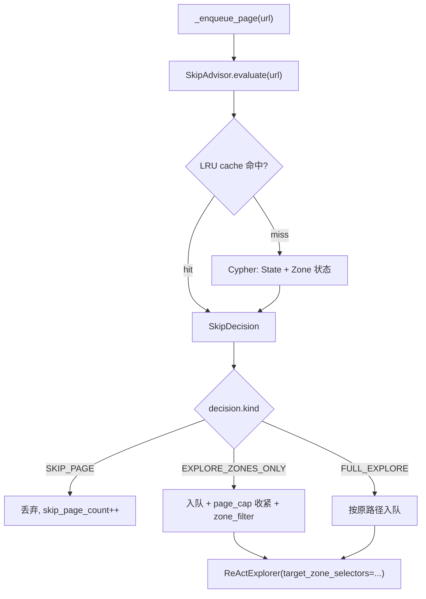
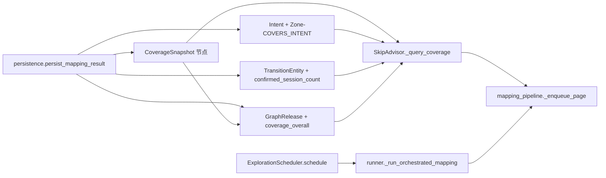

# Cartography 模块分层说明

`graph_agent.cartography` 负责网站自动测绘，当前按单一职责拆分为以下层次：

- `runner.py`
  - 对外入口（`run_mapping` + CLI）
  - 负责串联配置、登录、pipeline 执行与结果持久化
- `mapping_pipeline.py`
  - 多页面探索执行引擎
  - 管理队列、预算、跨域恢复、页内探索调度
- `llm_planning.py`
  - 页面分析与下一步探索规划（结构化输出）
- `login.py`
  - 登录检测、表单填充、菜单文本点击、自动登录流程
- `captcha.py`
  - 验证码图像采集与识别路由（ddddocr 优先 + LLM fallback）
- `persistence.py`
  - 将 `CartographyResult` 持久化到 Neo4j
- `skip_advisor.py`
  - 跨 session 跳过已探索区域的决策中心（见下文）
- `config.py`
  - URL/环境变量/timeout/inventory 等配置工具
- `browser_lifecycle.py`
  - 浏览器生命周期管理、信号处理与关停状态

## 典型调用链

1. `runner.run_mapping()` 读取配置并启动浏览器
2. `login` 执行预登录（含 `captcha`）
3. `mapping_pipeline.run_orchestrated_mapping()` 执行多页探索
4. `persistence.persist_mapping_result()` 写入图数据库

## 维护约定

- 新增能力时优先落到对应职责层，不直接堆到 `runner.py`
- `mapping_pipeline.py` 专注流程控制，不直接承担落库逻辑
- 登录与验证码相关逻辑统一走 `login.py` / `captcha.py`

## SkipAdvisor — 跨 session 跳过已探索区域

历史 warm start 只在启动阶段查一次 Neo4j 并把候选 URL 整批入队，无法在调度时
判定“某 URL 是否已经探索完整”。`skip_advisor.py` 把判定升级为运行时三态决策，
复用 `Zone.exploration_status` (`undiscovered/discovered/partial/explored/validated`)
与 `last_explored` / `State.last_visited` 字段，不引入新节点。

### 决策状态机



### 决策规则（`balanced` 档默认）

- `coverage >= skip_threshold (0.9)` 且 `last_explored/last_visited age <= ttl` 且
  无 pending zones → `SKIP_PAGE`
- `0.4 <= coverage < 0.9` 或存在 partial zone → `EXPLORE_ZONES_ONLY`
  （携带 pending zone selector 列表，`page_cap` 收紧到 15）
- 其它 → `FULL_EXPLORE`

`coverage` 计算：`(explored + 0.5 * partial) / total`；当 state 已访问但未识别出
zone 时，使用 fallback `0.5`。

### Profile

| Profile | skip_threshold | zones_only_threshold | ttl_hours |
|---------|----------------|----------------------|-----------|
| conservative | 0.95 | 0.6 | 8 |
| balanced (默认) | 0.9 | 0.4 | 24 |
| aggressive | 0.7 | 0.3 | 72 |

### 环境变量

| 名称 | 默认 | 说明 |
|------|------|------|
| `CARTOGRAPHY_SKIP_ADVISOR_ENABLED` | `true` | 总开关，关闭后退化为旧 warm start 流程 |
| `CARTOGRAPHY_SKIP_POLICY_PROFILE` | `balanced` | `conservative` / `balanced` / `aggressive` |
| `CARTOGRAPHY_SKIP_TTL_HOURS` | profile 默认 | 覆盖 `ttl_hours` |
| `CARTOGRAPHY_SKIP_QUERY_TIMEOUT_MS` | `300` | 单次 Neo4j 查询超时 |
| `CARTOGRAPHY_SKIP_CACHE_TTL_SEC` | `60` | 决策结果 LRU TTL |

### 失败兜底

任何路径异常都会让 `SkipAdvisor.evaluate` 返回 `FULL_EXPLORE`，并：
- 累计 `skip_timeout_count` / `skip_error_count`
- 连续失败超过 `failure_threshold (3)` → 熔断 `cooldown_sec (60)` 秒
- 熔断期间所有 evaluate 直接返回 `FULL_EXPLORE`，主循环不被阻断

### 可观测性

`run_orchestrated_mapping` 在 `result.layout_metrics` 中追加：

- `skip_advisor_enabled`
- `skip_evaluations` / `skip_cache_hit_count` / `skip_query_avg_ms`
- `skip_page_count` / `skip_zones_only_count` / `skip_full_explore_count`
- `skip_page_in_enqueue` / `skip_page_in_loop` / `skip_zones_only_in_loop`
- `skip_timeout_count` / `skip_error_count` / `skip_circuit_open_count`

### 数据写回（Phase 0 配套）

为让 advisor 拿到真实信号，本次同时打通了 zone 状态的写回链路：

- `mapping_pipeline.py` 创建 Zone 时设 `exploration_status=DISCOVERED`
- 每页探索结束后，按本页 transition 数推断 `partial` / `explored`，并设
  `last_explored`
- `persistence.py` → `manager.add_zones` 的 Cypher 用优先级比较保证
  `explored/validated` 不会被新一轮 session 倒退回 `discovered`

### 回归命令

在已经被探索过的 app 上重跑 mapping，期望 `skip_page_count > 0` 且
`new_transition_per_step` 不显著下降：

```bash
uv run python -m graph_agent.cartography.runner --url <APP_URL>
```

切换 profile 测试激进/保守效果：

```bash
CARTOGRAPHY_SKIP_POLICY_PROFILE=aggressive uv run python -m graph_agent.cartography.runner --url <APP_URL>
```

## 长期学习沉淀闭环（L1 – L5）

SkipAdvisor 第一版只看本页 zone 状态。第二版在原有数据之上增加了 **跨 session 的
学习信号**，让 mapping 真正做到“越用越聪明”：每次 session 结束都会沉淀一组可被
下次 session 直接复用的指标，并在 SkipAdvisor / ExplorationScheduler 的决策中
循环放大。

### 数据闭环



### 新写入

| 节点 / 边 | 何时写 | 谁会读 |
|----------|--------|--------|
| `(:CoverageSnapshot)` | release 写完后 `CoverageAnalyzer.compute` 一次 | `SkipAdvisor`（通过 `GraphRelease.coverage_overall`） |
| `(:Session)-[:ACHIEVED]->(:CoverageSnapshot)` | 同上 | 历史 session 看板 |
| `(:GraphRelease)-[:HAS_COVERAGE]->(:CoverageSnapshot)` | 同上，并把 5 个覆盖率字段同步写到 release 上 | `SkipAdvisor`、`KnowledgeBroker` |
| `(:Intent)`、`(:Transition)-[:REALIZES]->(:Intent)` | 每条 transition 持久化时（之前只有 `merger.py` 写，从不在生产路径触发） | 所有 intent 查询 |
| `(:Zone)-[:COVERS_INTENT {observed_count, confidence, last_confirmed_at}]->(:Intent)` | 同上，按 zone.selector 与 transition.selector 互为子串关系匹配 | `SkipAdvisor._query_coverage` 聚合为 `intent_confirm_total` |
| `TransitionEntity.confirmed_session_count` | `add_transition_entity_with_session` 按 session_id 去重累加 | `SkipAdvisor` 的 `entity_confirm_total` |

### SkipAdvisor 增强决策

`SkipDecision` 新增字段：

- `release_coverage`：当前 app 最新 active release 的整体覆盖度
- `intent_confirm_total`：本页 zone 上 `COVERS_INTENT.observed_count` 之和
- `entity_confirm_total`：本页 from_state 关联的 TransitionEntity 中
  `confirmed_session_count - 1` 的总和（衡量"已被多个独立 session 复现"）
- `intent_confirmed_zone_count`：有 intent 反向边的 zone 数量

新增决策路径 **learned_skip**：当本地 coverage 还没达 `skip_threshold_coverage`
但满足以下条件时也允许 `SKIP_PAGE`：

- `intent_confirm_total >= intent_confirm_skip_threshold`
- `entity_confirm_total >= entity_confirm_skip_threshold`
- `release_coverage >= release_coverage_floor`
- 在 TTL 内且无 pending zone

各 profile 的阈值：

| Profile | intent_confirm_skip | entity_confirm_skip | release_coverage_floor |
|---------|---------------------|---------------------|------------------------|
| aggressive | 2 | 2 | 0.55 |
| balanced (默认) | 3 | 3 | 0.70 |
| conservative | 5 | 5 | 0.85 |

### ExplorationScheduler 接入 warm-start

`runner._run_orchestrated_mapping` 的 warm-start 阶段除了拉历史高置信 transition
之外，还会：

1. 调 `coverage.scheduler.ExplorationScheduler.schedule(focus="breadth", app_id=...)`
   产出 `discover_page` / `explore_zone` / `stale_re_explore` 任务；
2. 把任务转换为 candidate（带 `scheduler_priority`、`scheduler_task_type`、
   `scheduler_reason`），与静态 candidate 合并送进 `rank_warm_start_candidates`；
3. `rank_warm_start_candidates` 按 `scheduler_priority` 降序排在最前面；
4. `mapping_pipeline._enqueue_page` 接收 `scheduler_hint`，对 `explore_zone` /
   `stale_re_explore` 任务强制走 `EXPLORE_ZONES_ONLY`，避免对已知页面再做一遍
   完整 ReAct 循环；即便 SkipAdvisor 想 `SKIP_PAGE`，scheduler 任务也至少
   补一次 zones-only。

新环境变量：

| 名称 | 默认 | 说明 |
|------|------|------|
| `CARTOGRAPHY_SCHEDULER_WARM_START_ENABLED` | `true` | 是否在 warm-start 阶段调度器注入 |
| `CARTOGRAPHY_SCHEDULER_WARM_START_TOPK` | `50` | 一次最多注入多少 candidate |

新指标（`result.layout_metrics`）：

- `skip_learned_skip_count` —— learned_skip 触发次数
- `skip_intent_confirm_total_seen` / `skip_entity_confirm_total_seen` —— 累计
  读到的学习信号强度
- `scheduler_zones_only_forced` —— 调度器对 SkipAdvisor 决策的强制降级次数

### 端到端验证

```bash
# 第一次跑：建立基线
uv run python -m graph_agent.cartography.runner --url <APP_URL>

# 第二次跑：期望出现以下变化
#  - skip_learned_skip_count > 0（说明已沉淀的 intent/entity 在生效）
#  - 探索时间 < 第一次（warm-start 阶段已注入"已知缺口"任务）
#  - GraphRelease.coverage_overall 比上一次只增不降
uv run python -m graph_agent.cartography.runner --url <APP_URL>
```

直接查询 Neo4j 查看新写入：

```cypher
// 最近 5 次 session 的 coverage 趋势
MATCH (s:Session)-[:ACHIEVED]->(c:CoverageSnapshot)
RETURN s.id, c.overall_completeness, c.zone_coverage, c.captured_at
ORDER BY c.captured_at DESC
LIMIT 5;

// 哪些 zone 已经累积到强 intent 信号
MATCH (z:Zone)-[r:COVERS_INTENT]->(i:Intent)
WHERE r.observed_count >= 3
RETURN z.id, z.selector, i.key, r.observed_count, r.confidence
ORDER BY r.observed_count DESC LIMIT 20;

// 哪些 transition 被多 session 复现（高置信稳定路径）
MATCH (e:TransitionEntity)
WHERE e.confirmed_session_count >= 3
RETURN e.stable_key, e.from_state_id, e.action, e.confirmed_session_count
ORDER BY e.confirmed_session_count DESC LIMIT 20;
```
